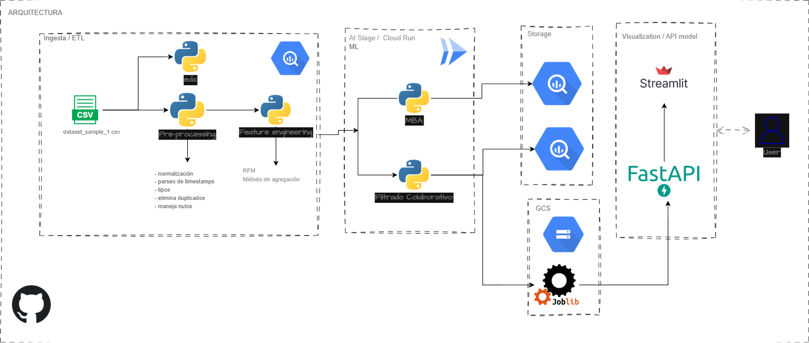

# Caso de Estudio 2 — Sistema de Recomendación en E-commerce  

## Descripción General  
El propósito de este proyecto es **diseñar e implementar un sistema de recomendación de productos** que ayude a los clientes de una tienda en línea a descubrir artículos relevantes basados en su comportamiento histórico de compra.  

La idea central:  
- Si el cliente A y el cliente B compran productos similares, y A adquirió un producto que B aún no ha comprado, el sistema podría recomendarle ese producto a B.  

Este tipo de soluciones son fundamentales en e-commerce modernos, pues mejoran la experiencia del cliente, incrementan la conversión y permiten personalizar las campañas de marketing.

---

## Metodología  

El desarrollo se organiza siguiendo un flujo analítico completo, desde la exploración de los datos hasta la simulación del despliegue de las recomendaciones.

### 1. Exploración y Limpieza de Datos  
- Se analizan las tablas `Data set_1` y `Data set_2` para validar consistencia y tipos de datos.  
- Se validan duplicados y valores nulos.  
- Se realiza un análisis exploratorio básico de ventas, categorías y distribución de compras.  

### 2. Feature Engineering  
- Construcción de la **matriz usuario-producto**, con el valor total de ventas (`VENTA_BRUTA_CON_IVA`).  
- Cálculo de métricas de comportamiento del cliente:
  - **Recencia (R):** tiempo desde la última compra.  
  - **Frecuencia (F):** número total de compras.  
  - **Valor Monetario (M):** monto total gastado.  
- Representación de productos por su categoría y volumen de compra.  

---

## 3. Modelos Implementados  

Se implementaron tres enfoques complementarios para el sistema de recomendación:

###  A. Filtrado Colaborativo (NMF)  
El modelo **NMF (Non-negative Matrix Factorization)** analiza la matriz de compras para descubrir **patrones comunes entre los clientes**.  
Por ejemplo:  
- “Las personas que compran celulares también suelen comprar cargadores y audífonos.”  

Cada cliente se representa como una combinación de estos patrones y, con base en ello, el modelo **predice productos que podrían interesarle**.  

---

### B. Análisis RFM  
El modelo RFM (Recency, Frequency, Monetary) permite **segmentar a los clientes según su comportamiento de compra**:  

| Métrica | Descripción |
|----------|-------------|
| Recency | Días desde la última compra |
| Frequency | Total de compras realizadas |
| Monetary | Monto total gastado |

Ejemplo de interpretación:
- **Clientes VIP:** alta frecuencia, alto gasto, baja recencia.  
- **Clientes en riesgo:** baja frecuencia, alta recencia.  

**Aplicación práctica:**  
Este análisis sirve para personalizar promociones o determinar qué tipo de productos ofrecer según el segmento del cliente.  

---

### C. Market Basket Analysis (MBA)  
El **Market Basket Analysis** busca descubrir reglas de asociación entre productos.  
Por ejemplo:  
- “El 65% de los clientes que compran pan también compran leche.”  

Se aplica el algoritmo **Apriori**, que identifica combinaciones frecuentes de productos y genera reglas del tipo:  {Pan} → {Leche}

---

## 4. Evaluación y Validación  
Se aplican métricas de evaluación offline para medir la calidad de las recomendaciones:  
- **Precision@K:** proporción de recomendaciones relevantes.
- Ej: El modelo recomienda 5 productos (K=5) a un usuario, y él solo ha comprado 2 de ellos: precision@5 = 2 / 5 = 0.4
- En este MVP se obtuvo: Precision@5 = 0.1134, significa que, en promedio, el 11% de las 5 recomendaciones más altas sí estaban entre los productos que el usuario compró. En este caso, el modelo se podría mejorar para aumentar esa precisi+on.

### Prueba A/B para medir el impacto potencial en la tasa de conversión:

Se Dividiria los usuarios en dos grupos:

- Grupo A (control): ve recomendaciones actuales (por ejemplo, productos populares o aleatorios).
- Grupo B (tratamiento): ve las recomendaciones del nuevo modelo (por ejemplo, CF).
- Se registras el comportamiento durante un periodo (real o simulado): compras

Comparar métricas:
Ejemplo: si la conversión en A es 3.5% y en B es 4.2%, el up = +0.7%.

---

## 5. Despliegue Simulado  

### Backend  
- **FastAPI** expone un endpoint `/recommend` que recibe el identificador de un usuario y devuelve sus recomendaciones personalizadas.  

### Frontend  
- **Streamlit** proporciona una interfaz interactiva para seleccionar un usuario, visualizar sus compras y explorar las recomendaciones del modelo.  

### Frecuencia de actualización  
- La matriz usuario-producto y los embeddings se actualizarian cada 24 h para reflejar las nuevas compras.  

---

## Stack Tecnológico  

| Capa | Tecnología / Librería |
|------|------------------------|
| Exploración / Limpieza | pandas, numpy, matplotlib, seaborn |
| Modelado | scikit-learn, mlxtend |
| Backend | FastAPI |
| Frontend | Streamlit |
| Almacenamiento | CSV |
| Control de versiones | Git / GitHub |

---

## Arquitectura General  

**Flujo End-to-End:**
1. Ingesta y preprocesamiento de datos  
2. Generación de features y matrices (usuario-producto, RFM, transacciones)  
3. Entrenamiento y evaluación de modelos  
4. Serialización y versionado de los modelos  
5. Exposición de recomendaciones vía API  
6. Visualización y simulación de resultados en Streamlit  

---

## Ejecución del Proyecto  

### 1. Crear entorno virtual  
python -m venv .venv
source .venv/bin/activate   # En Windows: .venv\Scripts\activate

1. Instalar dependencias
- pip install -r requirements.txt

2. Ejecutar API
- uvicorn app.main:app --reload --port 8000

3. Ejecutar interfaz Streamlit
- streamlit run app/app.py

### Arquitectura
